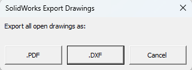

# Nova SolidWorks Macros

### If you’re new to SolidWorks macros, here are [instructions](https://help.solidworks.com/2024/english/SolidWorks/sldworks/c_recording_playing_macros.htm?verRedirect=1) to get started

### Overview
We’ve all been there, needing to export a whole bunch of parts and drawings you’ve just updated for an ECO or for a vendor handoff. Or you need to save every part in an assembly to 3D print! 

This document provides an overview of 3 macros developed by Nova for exporting SolidWorks files in different formats:
- Export all open drawings as PDF or DXF
- Export all open parts and assemblies as STEP
- Export all open parts (including child parts of open assemblies) as STL

## Export All Open Drawings as PDF or DXF
**Works on**: SolidWorks Drawing Document (`.SLDDRW`) files
**Output**: either `.PDF` or `.DXF` files
**Features**:
- Exports **every** drawing currently open in SolidWorks as a `.PDF` or as a `.DXF` file depending on which filetype is chosen in the window that appears below

- Exports the `.PDF`/`.DXF` files to the same folder that the drawings live in
- Full export filenames follow the format `(drawing)filename_(part)revision`
  - The drawing filename is used for the first part of the export filename
    - This means that the drawing filename will be used for the export filename regardless of whether the part referenced by the drawing has a different filename from the drawing or not
    - The part revision is used for the second part of the export filename

## Export All Open Parts and Assemblies as STEP
**Works on**: SolidWorks Part Document (`.SLDPRT`) and/or SolidWorks Assembly Document (`.SLDASM`) files
**Output**: `.STEP` files
**Features**:
- When exporting assemblies:
  - All child parts and the top level assembly are exported
  - For assemblies with subassemblies, all subassemblies and all child parts of the subassemblies are also exported with the child parts and the top level assembly
- Exports the `.STEP` files to the same folder that the parts and/or assemblies live in
- Full export filenames follow the format `filename_revision` (Revision set in custom properties)

## Export All Open Parts as STL
**Works on**: SolidWorks Part Document (`.SLDPRT`) and/or SolidWorks Assembly Document (`.SLDASM`) files
**Output**: `.STL` files
**Features**:
- When exporting assemblies:
  - **Only** child parts are exported
  - For assemblies with subassemblies, **subassemblies are ignored**
- Exports the `.STL` files to the same folder that the parts and/or assemblies live in
- Uses whatever resolution the `.STL` resolution setting is set at on your version of SW
- Full export filenames follow the format `filename_revision.STL` (Revision set in custom properties)

### License - GNU General Public License v3.0 (GPL-3.0)
- GitHub repository (see `COPYING.txt` for details)
- Note that we do not intend these Macros to be resold or put into paid software services. 
- Please use them in the spirit we offer them, which is to make your own life and the lives of the engineers around you easier. Feel free to share widely, make them your own, but please do not create sellable products based off them.
- Thanks to Deepak Gupta for starting this code, which we have modified, updated, and tested. See more from him [here](https://gupta9665.wordpress.com/) 
- These macros have been tested with SolidWorks 2024. Future versions are not guaranteed to work. (last updated June 2025)